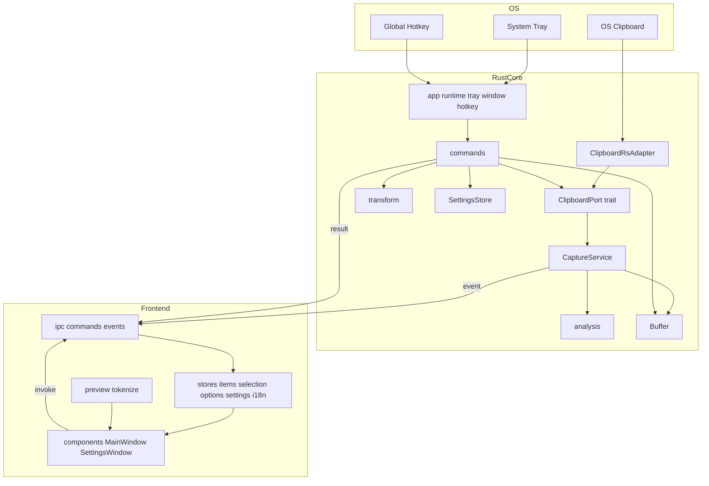
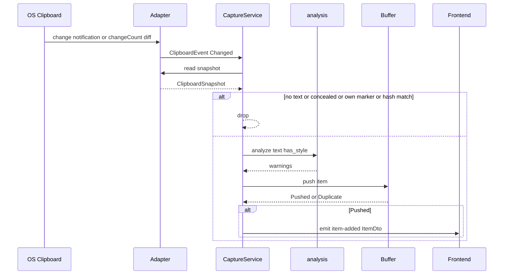
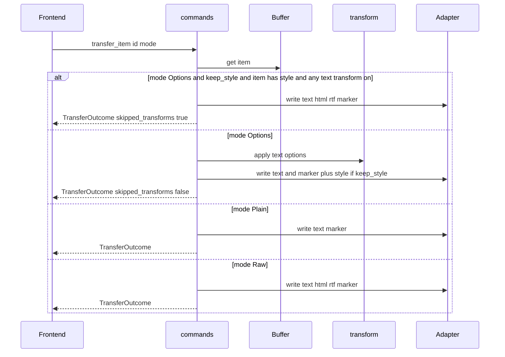
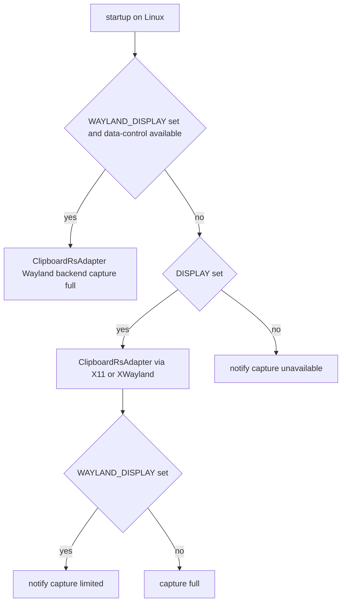

# Design Document — clipbuf-mvp

## Overview

**Purpose**: clipbuf は、他アプリでコピーされたテキストを自動で取り込み、貼り付け前に事故要因（書式、空白、改行、機種依存文字、制御文字）を可視化・警告し、1 クリックで無害化してクリップボードへ書き戻すデスクトップ常駐アプリである。本設計は初期リリース（MVP）の全機能を対象とする。

**Users**: Windows / macOS / Linux でアプリ間のコピー＆ペーストを日常的に行うユーザーが、貼り付け先を汚さないための確認と無害化に使う。

**Impact**: 新規プロジェクト。既存システムはない。

### Goals
- 他アプリのコピーを 1 秒以内に取り込み、直近 N 件を 1 行表示で保持する（1.x, 2.x）
- 不可視文字の可視化と 7 種の警告を 3 OS で同一の判定で提供する（3.x, 5.x）
- トグル式の転送オプションで無害化し、非破壊で書き戻す（6.x, 7.x）
- 最前面フローティング + ホットキー + トレイ常駐で作業の流れを止めない（8.x, 9.x）
- 履歴を端末外・ディスクに出さない（10.x）
- GitHub Releases から 3 OS 向けに配布し、承諾制で更新する（13.x）

### Non-Goals
- 画像・ファイル・その他非テキスト形式の履歴
- 履歴の永続化、検索、ピン留め
- クラウド同期
- 画面端ドッキング
- Flatpak / Mac App Store / Microsoft Store
- 取り込んだテキストの編集
- 最終的なアプリ名の決定（リリース直前の独立作業。識別子 `identifier` はその時点で確定する）

## Boundary Commitments

### This Spec Owns
- クリップボードの変化監視、内容の読み取り、書き戻し（OS 別アダプタを含む）
- 取り込み項目のモデル、FIFO 保持、削除
- 警告判定と転送時テキスト変換の定義と実装
- メインウィンドウ（リスト、プレビュー、警告、トグル、キーボード操作）と設定ウィンドウ
- トレイ、グローバルホットキー、自動起動、単一インスタンス、ウィンドウ位置の復元
- 設定の型と永続化
- 更新確認・承諾・適用のフロー
- CI（3 OS ビルド・テスト）とリリースワークフロー、README の案内文、THIRD-PARTY 生成
- Rust ↔ frontend の command / event 契約

### Out of Boundary
- OS のクリップボード挙動そのもの（コピー元・貼り付け先アプリには介入しない）
- 秘匿マークの付与（パスワードマネージャ側の責務。clipbuf は検出のみ）
- macOS のペーストボード許可の取得（ユーザー操作。clipbuf は案内のみ）
- Wayland コンポジタが data-control を提供しない場合の回避策
- コード署名証明書・Apple Developer アカウントの管理（CI の secrets として与えられる前提）

### Allowed Dependencies
- Tauri 2 本体と公式プラグイン: global-shortcut, autostart, updater, single-instance, window-state
- クリップボード: `clipboard-rs`（Windows / macOS / Linux X11・Wayland。Wayland は `wayland` feature で `wl-clipboard-rs` の data-control を使用）
- macOS の許可状態確認: `objc2-app-kit`（`NSPasteboard.accessBehavior` のみ）
- 文字処理: `encoding_rs`（Shift_JIS 判定）、`unicode-normalization`（NFC/NFD 判定）
- Frontend: Svelte 5, Vite, TypeScript, Vitest
- 依存の向き（違反は設計違反として扱う）:
  `model` → `analysis` / `transform` / `buffer` → `clipboard` / `settings` → `app`（runtime: state, capture, commands, tray, window, hotkey） → frontend

### Revalidation Triggers
- command / event の payload（`ItemDto`, `TransferOutcome`, `Settings`, `AppError`）の形状変更
- `Warning` enum の variant 追加・削除（frontend のアイコン・i18n と同期が必要）
- `ClipboardPort` trait のシグネチャ変更（全アダプタとフェイクに影響）
- 設定スキーマの変更（`settings.json` の互換性）
- 更新エンドポイント URL・署名鍵の変更（既存インストールの更新経路に影響）
- `identifier` の変更（別アプリ扱いになる。リリース後は変更しない）

## Architecture

### Architecture Pattern & Boundary Map



**Architecture Integration**:
- Selected pattern: **Rust core が状態を保持し、frontend は写しを描画**するポート & アダプタ構成。クリップボードだけを `ClipboardPort` で抽象化し、OS 別に 2 つのアダプタを置く
- Domain boundaries: 純粋ロジック（`analysis`, `transform`, `buffer`）は OS・Tauri に依存しない。OS 依存は `clipboard/` 配下と `app/` の runtime 配線に限定する
- New components rationale: `CaptureService` は「監視イベント → フィルタ → 判定 → 保持 → 通知」の唯一の経路。`commands` はロジックを持たない薄い入口
- Steering compliance: `tech.md` の責務分割、`structure.md` のモジュール分割と依存の向きに準拠

### Technology Stack

| Layer | Choice / Version | Role in Feature | Notes |
|-------|------------------|-----------------|-------|
| Frontend | Svelte 5 + Vite 7 + TypeScript 5（strict） | リスト・プレビュー・トグル・設定 UI、i18n | 判定ロジックを持たない |
| Frontend test | Vitest | `preview/tokenize` とストアの単体テスト | |
| Core | Rust stable（edition 2024）+ Tauri 2.x | 監視、判定、変換、保持、設定、トレイ、ホットキー | |
| Clipboard | `clipboard-rs` 0.3.5（`default-features = false`, `features = ["wayland"]`） | 監視と多形式読み書き。Linux は `WAYLAND_DISPLAY` で Wayland / X11 をクレート内で実行時選択 | Wayland も macOS と同様にポーリング監視 |
| Text | `encoding_rs`、`unicode-normalization` | 機種依存文字・正規化混在の判定 | |
| Settings | 素の JSON ファイル（`serde_json` + 一時ファイル → rename） | アプリデータディレクトリの `settings.json` | 項目内容は保存しない。Rust からのみアクセスするためプラグイン不要 |
| Window / Tray | Tauri 本体、`tauri-plugin-window-state` | 最前面、トレイ、位置・サイズ復元 | |
| Hotkey / Autostart | `tauri-plugin-global-shortcut`、`tauri-plugin-autostart` | 表示切替、ログイン時起動 | |
| Single instance | `tauri-plugin-single-instance` | 二重起動時は既存ウィンドウを表示 | |
| Update | `tauri-plugin-updater` | GitHub Releases の `latest.json` から承諾制で更新 | minisign 署名 |
| CI / Release | GitHub Actions + `tauri-action` | 3 OS ビルド、署名・公証、成果物添付 | `cargo-about` で THIRD-PARTY 生成 |

## File Structure Plan

### Directory Structure
```
clipbuf/
├── src-tauri/
│   ├── Cargo.toml
│   ├── tauri.conf.json                 # 単一ウィンドウ main（alwaysOnTop, skipTaskbar）、bundle targets、updater endpoint
│   ├── capabilities/default.json       # main / settings ウィンドウの許可
│   └── src/
│       ├── main.rs                     # エントリ。lib::run() を呼ぶだけ
│       ├── lib.rs                      # Tauri Builder 組み立て、プラグイン登録、app::bootstrap 呼び出し
│       ├── model/
│       │   ├── mod.rs
│       │   ├── item.rs                 # ClipItem, ItemId, ClipboardSnapshot
│       │   ├── warning.rs              # Warning enum（7 種）
│       │   ├── options.rs              # TransferOptions, NewlineMode, TransferMode
│       │   ├── settings.rs             # Settings, Language, デフォルト値
│       │   └── error.rs                # AppError, ErrorKind（serde 化）
│       ├── analysis/
│       │   ├── mod.rs                  # analyze(text, has_style) -> Vec<Warning>
│       │   ├── edge.rs                 # 先頭末尾の空白・改行
│       │   ├── control.rs              # 制御文字・U+FFFD
│       │   ├── newline.rs              # 改行コード混在
│       │   ├── platform_dependent.rs   # CP932 拡張範囲判定
│       │   ├── encoding_notice.rs      # BOM、双方向制御、NFC/NFD 混在
│       │   └── charset.rs              # 空白・不可視文字の分類表（frontend の tokenize と対応）
│       ├── transform/
│       │   └── mod.rs                  # apply(text, &TransferOptions, tab_width) -> String と適用順
│       ├── buffer/
│       │   └── mod.rs                  # Buffer（VecDeque, capacity, dedupe, remove, clear）
│       ├── clipboard/
│       │   ├── mod.rs                  # ClipboardPort trait, ClipboardEvent, select_adapter()
│       │   ├── marker.rs               # 自己書き込みマーカー形式名と内容ハッシュ
│       │   ├── conceal.rs              # 秘匿マーク形式名の一覧と判定
│       │   ├── clipboard_rs.rs         # ClipboardRsAdapter（Windows / macOS / X11）
│       │   ├── macos_access.rs         # accessBehavior 確認（cfg(target_os = "macos")）
│       │   └── fake.rs                 # テスト用 FakeClipboard（cfg(test)）
│       ├── settings/
│       │   └── mod.rs                  # SettingsStore（load / save / apply 差分通知）
│       └── app/
│           ├── mod.rs                  # bootstrap(): 状態生成、アダプタ選択、監視開始、tray/hotkey 登録
│           ├── state.rs                # AppState（Mutex<Buffer>, SettingsStore, Box<dyn ClipboardPort>, LastWrite）
│           ├── capture.rs              # CaptureService: 監視イベント → フィルタ → analyze → buffer → emit
│           ├── ops.rs                  # コマンドのロジック（Tauri 非依存、フェイクでテスト）
│           ├── commands.rs             # #[tauri::command] 群（ops への薄い委譲。関数名 = コマンド名）
│           ├── events.rs               # イベント名定数と payload 型
│           ├── tray.rs                 # トレイメニュー
│           ├── window.rs               # 表示切替、close→hide、settings ウィンドウ生成、activation policy
│           ├── hotkey.rs               # ホットキー登録・再登録・失敗時の維持
│           └── platform.rs             # PlatformInfo（OS、Wayland/X11、取り込み可否）
├── src/
│   ├── main.ts                         # Svelte マウント
│   ├── App.svelte                      # ウィンドウラベルで MainWindow / SettingsWindow を切替
│   ├── lib/
│   │   ├── ipc/
│   │   │   ├── commands.ts             # invoke ラッパー（型付き）
│   │   │   ├── events.ts               # listen ラッパー（型付き）
│   │   │   └── types.ts                # ItemDto, Settings, TransferOutcome, AppError, Warning（Rust と同形）
│   │   ├── stores/
│   │   │   ├── items.ts                # 項目一覧（event で更新）
│   │   │   ├── selection.ts            # 選択中 ItemId、キーボード移動
│   │   │   ├── settings.ts             # Settings の写しと更新
│   │   │   └── i18n.ts                 # t(key)、言語切替
│   │   ├── preview/
│   │   │   ├── tokenize.ts             # text -> PreviewToken[]（上限 20,000 文字）
│   │   │   └── charset.ts              # 不可視文字の分類表（Rust の charset.rs と同内容）
│   │   └── components/
│   │       ├── MainWindow.svelte       # レイアウト、キーボードハンドラ、通知表示
│   │       ├── TransferOptions.svelte  # トグル列
│   │       ├── ItemList.svelte         # 行の列挙、選択
│   │       ├── ItemRow.svelte          # 1 行：PreviewLine + WarningIcons + ホバーアクション
│   │       ├── PreviewLine.svelte      # トークン描画、横スクロール、blur で先頭復帰
│   │       ├── WarningIcons.svelte     # 警告アイコン列 + ツールチップ
│   │       ├── FullTextPreview.svelte  # ホバー時の全文プレビュー（変換適用後、改行を反映）
│   │       ├── Notice.svelte           # 一時通知（転送完了、変換未適用、失敗、取り込み不可）
│   │       ├── UpdatePrompt.svelte     # 更新の通知と承諾
│   │       └── SettingsWindow.svelte   # 設定フォーム
│   └── locales/
│       ├── ja.json
│       └── en.json
├── tests/e2e/                          # @wdio/tauri-service（任意。CI Linux で実行）
├── .github/workflows/
│   ├── ci.yml                          # push/PR: 3 OS で lint, test, cargo build
│   └── release.yml                     # tag v*: tauri-action、署名・公証、latest.json、SHA256SUMS、THIRD-PARTY
├── about.toml                          # cargo-about 設定
├── doc/
│   ├── initial_brief.md
│   └── platform-checklist.md           # Windows / Linux(X11, Wayland) / macOS の手動確認項目
└── README.md                           # 導入、SmartScreen 回避、macOS 許可、Wayland 制約
```

### Modified Files
- なし（新規プロジェクト）

## System Flows

### 取り込みフロー



- 監視コールバックは OS スレッドで受けるため、`CaptureService` はチャネル経由で専用スレッドに渡し、読み取りと判定をそこで行う
- 100ms 以内に複数の変化が来た場合は最後の 1 件のみ読み取る（連続書き込みの抑制）

### 転送フロー



- 書き込み前に `LastWrite` へ内容ハッシュを記録し、直後の監視イベントを除外する
- 失敗時は `AppError { kind: WriteFailed }` を返し、UI が通知を出す

### Linux アダプタ選択



## Requirements Traceability

| Requirement | Summary | Components | Interfaces | Flows |
|-------------|---------|------------|------------|-------|
| 1.1 | 他アプリのコピーを先頭に追加 | Adapter, CaptureService, Buffer | ClipboardPort, item-added | 取り込み |
| 1.2 | 書式付きデータも保持 | Adapter, ClipItem | ClipboardSnapshot | 取り込み |
| 1.3 | テキスト無しは無視 | CaptureService | ClipboardSnapshot.text = None | 取り込み |
| 1.4 | 自己書き込み除外 | marker, LastWrite, CaptureService | ClipboardPort.write | 取り込み / 転送 |
| 1.5 | 秘匿マーク尊重 | conceal, CaptureService | ClipboardSnapshot.concealed | 取り込み |
| 1.6 | 連続重複排除 | Buffer | Buffer.push → Duplicate | 取り込み |
| 1.7 | 非表示中も取り込む | CaptureService（ウィンドウ状態に依存しない） | — | 取り込み |
| 1.8 | 1 秒以内に反映 | Adapter（poll 200ms）, CaptureService | item-added | 取り込み |
| 2.1 | 新しい順・上限 N | Buffer | Buffer.capacity | — |
| 2.2 | 超過時は古い順に削除 | Buffer | Buffer.push | — |
| 2.3 | 個別削除 | commands.remove_item, Buffer | remove_item, items-changed | — |
| 2.4 | 全削除 | commands.clear_items, Buffer | clear_items, items-changed | — |
| 2.5 | N 縮小時に切り詰め | SettingsStore → Buffer.set_capacity | set_settings, items-changed | — |
| 2.6 | 既定 N = 20 | Settings::default | — | — |
| 3.1 | 1 行 + 警告列 | ItemRow, WarningIcons | ItemDto | — |
| 3.2 | 改行を記号化して連結、本体は保持 | tokenize, PreviewLine, ClipItem | PreviewToken | — |
| 3.3 | 等幅フォント | PreviewLine（CSS） | — | — |
| 3.4 | 不可視文字の記号・色 | charset, tokenize, PreviewLine | PreviewToken.kind | — |
| 3.5 | 全角空白を区別 | charset, tokenize | PreviewToken.kind = fullwidthSpace | — |
| 3.6 | 幅内で最大文字数 | PreviewLine（overflow hidden、上限 20,000） | — | — |
| 3.7 | CRLF/LF/CR を色で区別 | charset, tokenize, PreviewLine, FullTextPreview | PreviewToken.value | — |
| 4.1 | 横スクロール | PreviewLine | — | — |
| 4.2 | 編集不可 | PreviewLine（非 contenteditable） | — | — |
| 4.3 | 選択・コピー不可 | PreviewLine（user-select none, copy 抑止） | — | — |
| 4.4 | フォーカス喪失で先頭へ | PreviewLine（blur / focusout ハンドラ） | — | — |
| 4.5 | ホバーで全文プレビュー | ItemRow, FullTextPreview | preview_transfer | 全文プレビュー |
| 4.6 | 可視化を保ち改行を反映 | FullTextPreview, tokenize | PreviewToken | 全文プレビュー |
| 4.7 | 転送オプション適用後を表示 | commands.preview_transfer, ops::resolve_transfer | TransferPreview | 全文プレビュー |
| 4.8 | ポインタが外れたら閉じる | ItemRow, FullTextPreview | — | 全文プレビュー |
| 5.1 | スタイルあり | analysis（has_style） | Warning::HasStyle | — |
| 5.2 | 先頭末尾の空白・改行 | analysis::edge | Warning::EdgeWhitespace | — |
| 5.3 | タブあり | analysis | Warning::HasTab | — |
| 5.4 | 機種依存文字 | analysis::platform_dependent | Warning::PlatformDependent | — |
| 5.5 | 制御文字・不正データ | analysis::control | Warning::ControlOrBinary | — |
| 5.6 | 改行コード混在 | analysis::newline | Warning::MixedNewlines | — |
| 5.7 | BOM・双方向制御・NFC/NFD 混在 | analysis::encoding_notice | Warning::EncodingNotice | — |
| 5.8 | 警告の説明表示 | WarningIcons（title / tooltip, i18n） | — | — |
| 5.9 | 非該当は非表示 | WarningIcons | ItemDto.warnings | — |
| 6.1 | クリックで転送 | ItemRow, commands.transfer_item | transfer_item(mode Options) | 転送 |
| 6.2 | Enter で転送 | MainWindow キーハンドラ | transfer_item | 転送 |
| 6.3 | 上下で選択移動 | selection store, MainWindow | — | — |
| 6.4 | 代替アクションを常時表示 | ItemRow | — | — |
| 6.5 | プレーンで転送 | commands.transfer_item | mode Plain | 転送 |
| 6.6 | 元のまま転送 | commands.transfer_item | mode Raw | 転送 |
| 6.7 | 完了ハイライト | ItemRow, Notice | TransferOutcome | 転送 |
| 6.8 | 表示状態・順序を変えない | commands（Buffer を変更しない）, MainWindow | — | 転送 |
| 6.9 | 元データ非破壊 | transform（新文字列を返す）, Buffer | — | 転送 |
| 6.10 | 書き込み失敗の通知 | commands, Notice | AppError WriteFailed | 転送 |
| 7.1 | トグル常時表示 | TransferOptions | Settings.transfer | — |
| 7.2 | 転送時点のトグルを適用 | commands.transfer_item（Settings を読む） | — | 転送 |
| 7.3 | トグルはアプリ共通・永続 | SettingsStore | set_settings | — |
| 7.4 | スタイル削除 | commands | write(text only) | 転送 |
| 7.5 | スタイル保持優先 + 通知 | commands, Notice | TransferOutcome.skipped_transforms | 転送 |
| 7.6 | 書式なし項目は変換適用 | commands, transform | — | 転送 |
| 7.7 | 改行削除 | transform | NewlineMode::Remove | — |
| 7.8 | 改行を空白に | transform | NewlineMode::Space | — |
| 7.9 | トリム | transform | TransferOptions.trim | — |
| 7.10 | タブ→空白 | transform | TransferOptions.tabs_to_spaces, Settings.tab_width | — |
| 7.11 | 全角空白→半角 | transform | TransferOptions.fullwidth_to_space | — |
| 7.12 | 適用順 | transform::apply | — | — |
| 8.1 | 最前面フローティング | tauri.conf（alwaysOnTop）, window | — | — |
| 8.2 | ホットキーで表示切替 | hotkey, window | — | — |
| 8.3 | 表示時に最新を選択 | window → event window-shown, selection store | window-shown | — |
| 8.4 | トレイ常駐 | tray | — | — |
| 8.5 | 閉じる＝非表示 | window（CloseRequested を prevent） | — | — |
| 8.6 | 位置・サイズ復元 | window-state plugin | — | — |
| 8.7 | リサイズ可 | tauri.conf（resizable, minWidth/minHeight） | — | — |
| 9.1 | 設定項目 | SettingsWindow, Settings | get_settings / set_settings | — |
| 9.2 | 設定の永続化 | SettingsStore | — | — |
| 9.3 | 再起動なしで反映 | SettingsStore.apply → hotkey / Buffer / autostart / i18n | settings-changed | — |
| 9.4 | ホットキー競合時は維持 | hotkey | AppError HotkeyUnavailable | — |
| 9.5 | 自動起動時は非表示 | autostart plugin（`--hidden`）, window | — | — |
| 9.6 | トグルは設定画面に置かない | SettingsWindow（transfer を含まない） | — | — |
| 10.1 | メモリのみ | Buffer（永続化コードなし）, SettingsStore（項目を含まない） | — | — |
| 10.2 | 終了時破棄 | プロセス終了で消える（永続化なし） | — | — |
| 10.3 | 内容を送信しない | updater 以外の通信なし、CSP | — | — |
| 10.4 | 更新確認以外の通信なし | tauri.conf（CSP, updater endpoint のみ） | — | — |
| 10.5 | ログに出さない | AppError（内容を含まない）, ログ方針 | — | — |
| 11.1 | 3 OS で動作 | CI matrix, アダプタ | — | — |
| 11.2 | 同一機能 | 純粋ロジックの共通化 | — | — |
| 11.3 | X11 / XWayland で取り込み | ClipboardRsAdapter | — | アダプタ選択 |
| 11.4 | data-control 対応 Wayland で取り込み | ClipboardRsAdapter（Wayland backend） | — | アダプタ選択 |
| 11.5 | 取り込み不可の通知 | platform, Notice | PlatformInfo.capture | アダプタ選択 |
| 11.6 | macOS 拒否時の案内 | macos_access, Notice | PlatformInfo.capture = Denied | — |
| 12.1 | 日英 UI | locales, i18n store | — | — |
| 12.2 | 初回 OS 日本語→日本語 | i18n store（navigator.language） | Settings.language = None | — |
| 12.3 | 初回それ以外→英語 | i18n store | — | — |
| 12.4 | 設定で上書き | SettingsWindow, i18n store | Settings.language | — |
| 13.1 | 3 OS 配布物 | release.yml, tauri.conf bundle | — | — |
| 13.2 | CI で生成 | release.yml | — | — |
| 13.3 | macOS 署名・公証 | release.yml（secrets） | — | — |
| 13.4 | Windows 未署名 + README | release.yml, README | — | — |
| 13.5 | SHA-256 併記 | release.yml | — | — |
| 13.6 | 起動時に更新確認・通知 | UpdatePrompt, updater plugin | — | — |
| 13.7 | 承諾で適用 | UpdatePrompt | — | — |
| 13.8 | 拒否で継続 | UpdatePrompt | — | — |
| 13.9 | ライセンス一覧同梱 | release.yml, about.toml | — | — |
| 13.10 | macOS 許可の README | README | — | — |

## Components and Interfaces

| Component | Domain/Layer | Intent | Req Coverage | Key Dependencies (P0/P1) | Contracts |
|-----------|--------------|--------|--------------|--------------------------|-----------|
| model | Core / types | 全層で共有する型 | 全般 | serde (P0) | State |
| analysis | Core / pure | 警告判定 | 5.1–5.7 | encoding_rs, unicode-normalization (P0) | Service |
| transform | Core / pure | 転送時テキスト変換 | 7.4–7.12 | — | Service |
| Buffer | Core / pure | FIFO 保持 | 1.6, 2.1–2.5, 6.9, 10.1 | model (P0) | Service, State |
| ClipboardPort + Adapters | Core / OS | 監視・読み書き | 1.1–1.5, 1.8, 11.3–11.6 | clipboard-rs (P0) | Service, Event |
| SettingsStore | Core / persistence | 設定の永続化と差分適用 | 2.5, 7.3, 9.1–9.3, 12.4 | serde_json, std::fs (P0) | Service, State |
| CaptureService | App / runtime | 取り込み経路 | 1.1–1.8 | ClipboardPort, analysis, Buffer (P0) | Event |
| commands | App / IPC | frontend からの操作入口 | 2.3, 2.4, 6.x, 7.x, 9.x | Buffer, transform, ClipboardPort, SettingsStore (P0) | API |
| window / tray / hotkey / platform | App / runtime | 常駐と表示制御 | 8.x, 9.4, 9.5, 11.5, 11.6 | Tauri plugins (P0) | Event |
| ipc (frontend) | Frontend / boundary | 型付き invoke / listen | 全 UI | @tauri-apps/api (P0) | API, Event |
| stores (frontend) | Frontend / state | 写しの保持と操作 | 3.x, 6.3, 8.3, 12.x | ipc (P0) | State |
| preview/tokenize | Frontend / pure | 表示用トークン化 | 3.2, 3.4, 3.5, 3.6 | charset (P0) | Service |
| components | Frontend / UI | 描画と入力 | 3.x, 4.x, 5.8, 5.9, 6.x, 7.1, 9.1, 9.6, 13.6–13.8 | stores, preview (P0) | — |
| CI / release | Ops | ビルド・配布 | 11.1, 13.1–13.5, 13.9 | tauri-action, cargo-about (P0) | Batch |

### Core / types

#### model

| Field | Detail |
|-------|--------|
| Intent | Rust 側の共有型。IPC で frontend に渡す DTO もここから派生する |
| Requirements | 全般 |

```rust
pub type ItemId = u64;

pub struct ClipboardSnapshot {
    pub text: Option<String>,
    pub html: Option<String>,
    pub rtf: Option<String>,
    pub concealed: bool,      // 秘匿マーク形式が存在
    pub own_marker: bool,     // clipbuf マーカー形式が存在
}

pub struct ClipItem {
    pub id: ItemId,
    pub captured_at: SystemTime,
    pub text: String,
    pub html: Option<String>,
    pub rtf: Option<String>,
    pub warnings: Vec<Warning>,
}
impl ClipItem { pub fn has_style(&self) -> bool }

#[derive(Serialize, Deserialize, Clone, Copy, PartialEq, Eq, Hash)]
#[serde(rename_all = "camelCase")]
pub enum Warning {
    HasStyle, EdgeWhitespace, HasTab, PlatformDependent,
    ControlOrBinary, MixedNewlines, EncodingNotice,
}

#[derive(Serialize, Deserialize, Clone, Copy, PartialEq, Eq)]
#[serde(rename_all = "camelCase")]
pub enum NewlineMode { Keep, Remove, Space }

#[derive(Serialize, Deserialize, Clone, Copy, PartialEq, Eq)]
#[serde(rename_all = "camelCase")]
pub struct TransferOptions {
    pub keep_style: bool,
    pub newline: NewlineMode,
    pub trim: bool,
    pub tabs_to_spaces: bool,
    pub fullwidth_to_space: bool,
}
impl TransferOptions { pub fn has_text_transform(&self) -> bool }

#[derive(Serialize, Deserialize, Clone, Copy, PartialEq, Eq)]
#[serde(rename_all = "camelCase")]
pub enum TransferMode { Options, Plain, Raw }

#[derive(Serialize, Deserialize, Clone, PartialEq, Eq)]
#[serde(rename_all = "camelCase")]
pub struct Settings {
    pub capacity: usize,            // 既定 20、範囲 1..=200
    pub hotkey: String,             // 既定 "Alt+Shift+V"
    pub tab_width: u8,              // 既定 4、範囲 1..=16
    pub poll_interval_ms: u32,      // 既定 200、範囲 50..=2000（macOS / Wayland ポーリングで使用）
    pub autostart: bool,            // 既定 false
    pub language: Option<Language>, // None = OS に従う
    pub transfer: TransferOptions,  // 既定 keep_style=false, newline=Keep, trim=false, tabs=false, fullwidth=false
}

#[derive(Serialize, Deserialize, Clone, Copy, PartialEq, Eq)]
#[serde(rename_all = "camelCase")]
pub enum Language { Ja, En }

#[derive(Serialize, Deserialize, Clone, PartialEq, Eq)]
#[serde(rename_all = "camelCase")]
pub struct ItemDto {
    pub id: ItemId,
    pub captured_at_ms: u64,
    pub text: String,
    pub has_style: bool,
    pub warnings: Vec<Warning>,
}

#[derive(Serialize, Deserialize, Clone, PartialEq, Eq)]
#[serde(rename_all = "camelCase")]
pub struct TransferOutcome { pub skipped_transforms: bool }

#[derive(Serialize, Deserialize, Clone, PartialEq, Eq)]
#[serde(rename_all = "camelCase")]
pub struct AppError { pub kind: ErrorKind }

#[derive(Serialize, Deserialize, Clone, Copy, PartialEq, Eq)]
#[serde(rename_all = "camelCase")]
pub enum ErrorKind {
    ItemNotFound, WriteFailed, ReadFailed, HotkeyUnavailable,
    InvalidSettings, CaptureUnavailable, SettingsIo,
}
```

- Invariants: `AppError` は項目テキストを含まない。`ItemDto.text` は全文（プレビューの横スクロールに必要）
- `Settings` の範囲外の値は `set_settings` で `InvalidSettings` として拒否する

### Core / pure

#### analysis

| Field | Detail |
|-------|--------|
| Intent | テキストと書式有無から `Vec<Warning>` を返す純粋関数群 |
| Requirements | 5.1–5.7 |

**Contracts**: Service [x]

```rust
pub fn analyze(text: &str, has_style: bool) -> Vec<Warning>;   // 重複なし、Warning の宣言順
pub fn has_edge_whitespace(text: &str) -> bool;                 // 先頭/末尾が char::is_whitespace（U+3000, NBSP, タブ, 改行を含む）
pub fn has_tab(text: &str) -> bool;
pub fn has_platform_dependent(text: &str) -> bool;              // encoding_rs SHIFT_JIS で 2 バイト化した結果が 0x8740–0x879E / 0xED40–0xEEFC / 0xFA40–0xFC4B
pub fn has_control_or_binary(text: &str) -> bool;               // C0（\t \n \r 除く）, DEL, C1, U+FFFD
pub fn has_mixed_newlines(text: &str) -> bool;                  // CRLF / lone LF / lone CR のうち 2 種以上
pub fn has_encoding_notice(text: &str) -> bool;                 // 先頭 U+FEFF、双方向制御（U+202A–U+202E, U+2066–U+2069）、または NFC≠text かつ NFD≠text
```

- `charset.rs` は不可視文字の分類表を定義する（下表）。frontend の `charset.ts` と同一内容にし、両方のテストで同じ入力表を使う

| 分類 | 文字 | 表示記号（frontend） |
|------|------|----------------------|
| space | U+0020 | `·` |
| fullwidthSpace | U+3000 | `□` |
| tab | U+0009 | `→` |
| newline | CRLF / LF / CR（CRLF は 1 トークン） | `↵` |
| nbsp | U+00A0, U+202F | `⍽` |
| zeroWidth | U+200B, U+200C, U+200D, U+2060, U+FEFF | `∅` |
| bidi | U+200E, U+200F, U+202A–U+202E, U+2066–U+2069 | `⇄` |
| control | C0（上記以外）, U+007F, U+0080–U+009F, U+FFFD | `�` |

#### transform

| Field | Detail |
|-------|--------|
| Intent | 転送オプションをテキストに適用し新しい文字列を返す |
| Requirements | 7.4–7.12 |

**Contracts**: Service [x]

```rust
pub fn apply(text: &str, options: &TransferOptions, tab_width: u8) -> String;
```

- 適用順（7.12）: (1) newline: `Remove` は CRLF/LF/CR を削除、`Space` は各改行（CRLF は 1 つ）を U+0020 1 つに置換 → (2) tabs_to_spaces: `\t` を `tab_width` 個の U+0020 に → (3) fullwidth_to_space: U+3000 を U+0020 1 つに → (4) trim: 先頭末尾の `char::is_whitespace` を除去
- `keep_style` は `apply` の対象外（書き込み側で扱う）
- Postconditions: 入力を変更しない。`options.has_text_transform() == false` なら入力と等しい文字列を返す

#### Buffer

| Field | Detail |
|-------|--------|
| Intent | 取り込み項目の FIFO 保持 |
| Requirements | 1.6, 2.1–2.5, 6.9, 10.1 |

**Contracts**: Service [x] / State [x]

```rust
pub enum PushResult { Pushed(ItemId), Duplicate }

pub struct Buffer { /* VecDeque<ClipItem>, capacity, next_id */ }
impl Buffer {
    pub fn new(capacity: usize) -> Self;
    pub fn push(&mut self, text: String, html: Option<String>, rtf: Option<String>, warnings: Vec<Warning>) -> PushResult;
    pub fn get(&self, id: ItemId) -> Option<&ClipItem>;
    pub fn remove(&mut self, id: ItemId) -> bool;
    pub fn clear(&mut self);
    pub fn set_capacity(&mut self, capacity: usize);   // 超過分を末尾（古い側）から削除
    pub fn items(&self) -> impl Iterator<Item = &ClipItem>;  // 新しい順
}
```

- `push` は先頭項目と `text` が等しい場合 `Duplicate`（html/rtf は比較しない）
- 上限超過時は最も古い項目を削除。`ItemId` は単調増加で再利用しない
- State: `AppState` 内の `Mutex<Buffer>`。永続化しない

### Core / OS

#### ClipboardPort と Adapters

| Field | Detail |
|-------|--------|
| Intent | クリップボードの監視・読み取り・書き込みの OS 非依存インターフェース |
| Requirements | 1.1–1.5, 1.8, 11.3–11.6 |

**Dependencies**
- External: `clipboard-rs`（Windows / macOS / Linux X11・Wayland）— 監視と多形式読み書き。Wayland は同クレートの `wayland` feature（`wl-clipboard-rs` の data-control）（P0）
- External: `objc2-app-kit`（macOS）— `accessBehavior` 確認のみ（P1）

**Contracts**: Service [x] / Event [x]

```rust
pub enum ClipboardEvent { Changed }

pub struct WritePayload<'a> {
    pub text: &'a str,
    pub html: Option<&'a str>,
    pub rtf: Option<&'a str>,
}

pub trait ClipboardPort: Send + Sync {
    /// 監視を開始し、変化のたびに sender へ Changed を送る。二重起動は Err
    fn start_watch(&self, sender: Sender<ClipboardEvent>) -> Result<(), ClipError>;
    /// 現在の内容を読む。テキスト形式が無ければ text = None
    fn read(&self) -> Result<ClipboardSnapshot, ClipError>;
    /// text と（あれば）html/rtf、および clipbuf マーカー形式を同時に書く
    fn write(&self, payload: WritePayload<'_>) -> Result<(), ClipError>;
    fn capability(&self) -> CaptureCapability;
}

pub enum CaptureCapability { Full, LimitedXWayland, Unavailable, Denied }

pub enum ClipError { Unavailable, Read, Write, WatchAlreadyStarted }

pub fn select_adapter(settings: &Settings) -> Box<dyn ClipboardPort>;   // OS と環境に応じて選択
```

- `ClipboardRsAdapter`: Windows はリスナー、macOS は `changeCount` を `poll_interval_ms` でポーリング（読み取りは変化時のみ）、X11 は XFixes（いずれも clipboard-rs の `ClipboardWatcher` を利用）。`read` は `available_formats` を先に取得し、秘匿形式（`conceal.rs` の一覧）とマーカー形式の有無を `ClipboardSnapshot` に反映する
- Linux の Wayland: 別アダプタは置かず、`ClipboardRsAdapter` が `clipboard-rs` の `wayland` feature を通じて扱う。クレートが `WAYLAND_DISPLAY` の有無で data-control（ext / wlr）と X11 を実行時に選び、data-control 初期化に失敗すると X11 にフォールバックする。監視はポーリング（`poll_interval_ms`）。`capability()` は選ばれたバックエンドで決める：Wayland → `Full`、X11 かつ `WAYLAND_DISPLAY` あり → `LimitedXWayland`、X11 のみ → `Full`
- マーカー形式名（`marker.rs`）: macOS `org.clipbuf.marker`、Windows 登録形式 `clipbuf-marker`、X11 / Wayland `application/x-clipbuf-marker`
- 秘匿形式名（`conceal.rs`）: `org.nspasteboard.ConcealedType`、`ExcludeClipboardContentFromMonitorProcessing`、`x-kde-passwordManagerHint`
- `macos_access.rs`: 起動時に `NSPasteboard.general.accessBehavior` を確認し `deny` なら `Denied`、`ask` は `Full` のまま（案内は README）
- `fake.rs`: テスト用。`push_change(snapshot)` で任意の内容と変化を注入し、`written()` で書き込み履歴を返す

**Implementation Notes**
- Integration: 監視コールバックは OS スレッドで呼ばれる。アダプタは `Sender` に送るだけにし、読み取りは `CaptureService` のスレッドで行う
- Validation: 実装初期に (a) Windows で登録形式名が `available_formats` に現れるか、(b) macOS で `set_buffer` の独自形式が他アプリのコピー後に消えるか、を確認する（`research.md` Follow-up）
- Risks: `clipboard-rs` の挙動差はアダプタ内に閉じる。取れない場合は `windows-sys` の `EnumClipboardFormats` を Windows アダプタ内に追加する

### Core / persistence

#### SettingsStore

| Field | Detail |
|-------|--------|
| Intent | `Settings` の読み書きと、変更の各サブシステムへの適用 |
| Requirements | 2.5, 7.3, 9.1–9.3, 12.4 |

**Contracts**: Service [x] / State [x]

```rust
pub struct SettingsStore { /* PathBuf, RwLock<Settings> */ }
impl SettingsStore {
    pub fn open(path: PathBuf) -> Result<Self, AppError>;      // 無ければ既定値で作成。不正値は既定値に置換
    pub fn load(app: &AppHandle) -> Result<Self, AppError>;   // app_data_dir()/settings.json で open
    pub fn get(&self) -> Settings;
    pub fn update(&self, next: Settings) -> Result<SettingsDiff, AppError>;  // 検証 → 保存 → 差分
}
pub struct SettingsDiff { pub capacity: bool, pub hotkey: bool, pub autostart: bool, pub language: bool, pub transfer: bool, pub poll_interval: bool }
```

- 保存先: アプリデータディレクトリの `settings.json`。一時ファイルに書いて rename する原子的書き込み。項目内容は含まない。純粋関数 `validate` / `sanitize` / `diff` を分離して単体テストする
- `update` は範囲検証に失敗すると `InvalidSettings` を返し、保存しない
- `SettingsDiff` を受けて `app` 層が hotkey 再登録、`Buffer.set_capacity`、autostart 切替、`settings-changed` event 送出を行う

### App / runtime

#### CaptureService

| Field | Detail |
|-------|--------|
| Intent | 監視イベントから項目追加までの唯一の経路 |
| Requirements | 1.1–1.8 |

**Contracts**: Event [x]

- 専用スレッドで `Receiver<ClipboardEvent>` を待つ。100ms のデバウンス後に `read()`
- フィルタ順: `text == None` → 破棄、`concealed` → 破棄、`own_marker` → 破棄、`LastWrite` のハッシュ一致 → 破棄
- `analyze` → `Buffer.push` → `Pushed` なら `clipbuf://item-added` を送出
- `read` 失敗は無視して次の変化を待つ（連続 5 回失敗で `clipbuf://capture-status` に `ReadFailed` を送る）

#### commands

| Field | Detail |
|-------|--------|
| Intent | frontend からの操作の入口。ロジックは持たず委譲する |
| Requirements | 2.3, 2.4, 6.1, 6.2, 6.5–6.10, 7.2, 7.4–7.6, 9.1–9.4, 11.5, 11.6 |

**Contracts**: API [x]

| Command | Request | Response | Errors |
|---------|---------|----------|--------|
| `list_items` | — | `Vec<ItemDto>`（新しい順） | — |
| `transfer_item` | `{ id: ItemId, mode: TransferMode }` | `TransferOutcome` | `ItemNotFound`, `WriteFailed` |
| `preview_transfer` | `{ id: ItemId }` | `TransferPreview { text, skippedTransforms }` | `ItemNotFound` |
| `remove_item` | `{ id: ItemId }` | `()` | `ItemNotFound` |
| `clear_items` | — | `()` | — |
| `get_settings` | — | `Settings` | — |
| `set_settings` | `{ settings: Settings }` | `Settings`（適用後） | `InvalidSettings`, `HotkeyUnavailable`, `SettingsIo` |
| `get_platform_info` | — | `PlatformInfo { os, display_server, capture: CaptureCapability }` | — |
| `hide_window` | — | `()` | — |

- 転送内容の決定は `ops::resolve_transfer(item, settings, mode)` に集約し、`transfer_item`（書き込む）と
  `preview_transfer`（書き込まずテキストだけ返す）が共有する。これによりプレビューは「実際に転送される内容」と一致する（4.7）
- `transfer_item` の分岐（転送フロー参照）:
  - `Options` かつ `keep_style` かつ `item.has_style()` かつ `has_text_transform()` → 元のまま書き込み、`skipped_transforms: true`
  - `Options` → `transform::apply` の結果を text に、`keep_style && has_style` なら html/rtf も書く
  - `Plain` → text のみ
  - `Raw` → text + html + rtf
- `set_settings` でホットキー登録に失敗した場合、設定は保存せず `HotkeyUnavailable` を返す（9.4）。他の項目の変更も同時に破棄されるため、UI はホットキー欄のエラーとして表示する

#### events

**Contracts**: Event [x]

| Event | Payload | Trigger |
|-------|---------|---------|
| `clipbuf://item-added` | `ItemDto` | CaptureService が Pushed |
| `clipbuf://items-changed` | `Vec<ItemDto>` | remove / clear / capacity 縮小 |
| `clipbuf://settings-changed` | `Settings` | set_settings 成功 |
| `clipbuf://window-shown` | `()` | ホットキー・トレイ・単一インスタンスで表示した直後（8.3） |
| `clipbuf://capture-status` | `CaptureCapability \| "readFailed"` | 起動時と状態変化時（11.5, 11.6） |

- 配信保証: Tauri の in-process event（順序保証あり、再送なし）。frontend は起動時に `list_items` で初期化し、以後は event で差分を反映する

#### window / tray / hotkey / platform

- `window.rs`: `main` ウィンドウは `tauri.conf.json` で `alwaysOnTop: true, skipTaskbar: true, visibleOnAllWorkspaces: true, decorations: true, resizable: true, minWidth 360, minHeight 240`。`CloseRequested` を `prevent_close` して `hide()`。`toggle()` は表示時に `set_focus` + `window-shown` 送出。`settings` ウィンドウは初回要求時に `WebviewWindowBuilder` で生成（ラベル `settings`、`alwaysOnTop: false`）。macOS は `ActivationPolicy::Accessory`（Dock に出さない）
  - **Settings の配置**: 最前面のメインウィンドウに隠れないよう、メインの右隣 → 左隣 → 下の順で、メインと同じモニタ内に置く（`place_beside`、純粋関数）
  - **Settings とメインの表示同期**: メインを隠す操作（ホットキー / トレイ / 閉じる / `hide_window`）は開いている Settings も隠し、次にメインを表示したとき一緒に復帰させる。Settings を終えるのはユーザーのクローズ操作のみ（「clipbuf を隠す＝全体をどける」という利用意図に合わせた実装時の判断）
- `tray.rs`: メニュー「表示/非表示」「設定」「終了」。左クリックで toggle
- `hotkey.rs`: `register(shortcut)` は既存を解除してから登録。失敗時は既存を再登録して `HotkeyUnavailable`
- 起動引数 `--hidden`（autostart plugin の `args`）でウィンドウを非表示のまま起動（9.5）
- `single-instance`: 2 つ目の起動は既存プロセスに通知し、`toggle()` で表示
- `platform.rs`: `PlatformInfo` を組み立て、起動時に `capture-status` を送出

### Frontend

#### ipc

```typescript
export type ItemId = number;
export type Warning = 'hasStyle' | 'edgeWhitespace' | 'hasTab' | 'platformDependent' | 'controlOrBinary' | 'mixedNewlines' | 'encodingNotice';
export type NewlineMode = 'keep' | 'remove' | 'space';
export type TransferMode = 'options' | 'plain' | 'raw';
export interface TransferOptions { keepStyle: boolean; newline: NewlineMode; trim: boolean; tabsToSpaces: boolean; fullwidthToSpace: boolean }
export interface Settings { capacity: number; hotkey: string; tabWidth: number; pollIntervalMs: number; autostart: boolean; language: 'ja' | 'en' | null; transfer: TransferOptions }
export interface ItemDto { id: ItemId; capturedAtMs: number; text: string; hasStyle: boolean; warnings: Warning[] }
export interface TransferOutcome { skippedTransforms: boolean }
export type ErrorKind = 'itemNotFound' | 'writeFailed' | 'readFailed' | 'hotkeyUnavailable' | 'invalidSettings' | 'captureUnavailable' | 'settingsIo';
export interface AppError { kind: ErrorKind }
export type CaptureCapability = 'full' | 'limitedXWayland' | 'unavailable' | 'denied';

export const commands: {
  listItems(): Promise<ItemDto[]>;
  transferItem(id: ItemId, mode: TransferMode): Promise<TransferOutcome>;
  removeItem(id: ItemId): Promise<void>;
  clearItems(): Promise<void>;
  getSettings(): Promise<Settings>;
  setSettings(settings: Settings): Promise<Settings>;
  getPlatformInfo(): Promise<{ os: string; displayServer: string; capture: CaptureCapability }>;
  hideWindow(): Promise<void>;
};
export function onItemAdded(cb: (item: ItemDto) => void): Promise<UnlistenFn>;
export function onItemsChanged(cb: (items: ItemDto[]) => void): Promise<UnlistenFn>;
export function onSettingsChanged(cb: (s: Settings) => void): Promise<UnlistenFn>;
export function onWindowShown(cb: () => void): Promise<UnlistenFn>;
export function onCaptureStatus(cb: (s: CaptureCapability | 'readFailed') => void): Promise<UnlistenFn>;
```

- `invoke` の reject は `AppError` として型を絞る（`isAppError` ガード）。コンポーネントは `ipc` 以外から `@tauri-apps/api` を import しない

#### preview/tokenize

```typescript
export type TokenKind = 'text' | 'space' | 'fullwidthSpace' | 'tab' | 'newline' | 'nbsp' | 'zeroWidth' | 'bidi' | 'control';
export interface PreviewToken { kind: TokenKind; value: string }   // text は連続する通常文字をまとめる
export const PREVIEW_LIMIT = 20_000;
export function tokenize(text: string): { tokens: PreviewToken[]; truncated: boolean };
```

- 分類は `charset.ts`（analysis の表と同一）。CRLF は 1 つの `newline` トークン
- `truncated` が真なら `PreviewLine` は末尾に省略記号を描く

#### stores

- `items`: `ItemDto[]`。`listItems` で初期化、`item-added` は先頭挿入、`items-changed` は置換
- `selection`: 選択中 `ItemId | null`。`moveUp/moveDown`、`window-shown` で先頭を選択（8.3）、項目削除で隣へ移動
- `settings`: `Settings` の写し。`TransferOptions` のトグル変更は `setSettings` を即時呼び出し（7.3）。失敗時は元に戻す
- `i18n`: `t(key)`。初期言語は `settings.language ?? (navigator.language.startsWith('ja') ? 'ja' : 'en')`（12.2, 12.3）

#### components（Summary-only）

- `MainWindow`: グローバルキー（↑↓ 選択、Enter = options 転送、Shift+Enter = plain 転送、Delete = 削除、Escape = `hideWindow`）。`Notice` と `UpdatePrompt` を配置。`capture-status` を受けて取り込み不可 / 限定 / 拒否の通知を出す
- `TransferOptions`: 書式（保持 / 削除のラジオ）、改行（そのまま / 削除 / 空白のラジオ）、トリム、タブ変換、全角空白変換。グループ間に区切り線を置く。`keepStyle` が有効なとき他のトグルを「書式付き項目には適用されない」旨のヒント付きで表示（無効化はしない：書式なし項目には適用されるため 7.6）
- `ItemRow`: クリックで `transferItem(id, 'options')`、「プレーン」「原文」ボタンを常時表示（警告アイコンと区別できるボタン様の見た目）、転送成功で 600ms のハイライト、`skippedTransforms` なら `Notice` へ通知。テキストへのホバーで `FullTextPreview` を開き、離れると閉じる（4.5, 4.8）
- `FullTextPreview`: `preview_transfer` の結果を `tokenize` し、改行トークンで実際に行を分けて描画する。タブは 1 文字分の記号。可視化とスクロールは `PreviewLine` と同じ規則。ポップオーバーは行の近くに出し、画面外にはみ出さないよう位置を補正する
- `PreviewLine`: `tokenize` の結果を `<span class={kind}>` で描画。改行は値（`\r\n` / `\n` / `\r`）で色を分ける（3.7）。`overflow-x: auto; white-space: nowrap; user-select: none`、`copy` イベントを `preventDefault`、`tabindex="0"`、`focusout` で `scrollLeft = 0`。行全体の高さは 1 行固定
- `WarningIcons`: `warnings` に含まれるものだけを固定順で描画。`title` に i18n の説明（5.8）
- `Notice`: 種別（success / info / error）と自動消去
- `UpdatePrompt`: 起動時に `check()`、更新があればバナー表示。承諾で `downloadAndInstall()` → 再起動確認。拒否でバナーを閉じる（13.6–13.8）
- `SettingsWindow`: capacity、hotkey（キー入力の記録 UI）、tabWidth、pollIntervalMs（macOS / Wayland 以外は非表示）、autostart、language。`transfer` は含まない（9.6）。`HotkeyUnavailable` はホットキー欄のエラーとして表示し他の変更も保持したまま再入力を促す

### Ops

#### CI / release

**Contracts**: Batch [x]

- `ci.yml`: trigger = push / pull_request。matrix = ubuntu-latest, windows-latest, macos-latest。steps = Linux 依存インストール（webkit2gtk-4.1, gtk3, ayatana-appindicator3, librsvg2, libxcb 系）→ `npm ci` → `npm run lint` → `npm test` → `cargo fmt --check` → `cargo clippy -- -D warnings` → `cargo test` → `cargo build`
- `release.yml`: trigger = tag `v*`。`tauri-action` で 3 OS ビルド。macOS は `APPLE_CERTIFICATE` 等の secrets で署名・公証。updater は `TAURI_SIGNING_PRIVATE_KEY` で署名し `latest.json` を生成。Windows は署名なし（NSIS のみ）。Linux は AppImage / deb / rpm。追加 step で `SHA256SUMS.txt` と `THIRD-PARTY.md`（`cargo-about` + npm ライセンス抽出）を生成して添付
- Idempotency: 同一タグの再実行は既存 Release の資産を上書き

## Data Models

### Domain Model
- 集約: `Buffer`（`ClipItem` の列）。トランザクション境界は `Mutex<Buffer>` の 1 操作
- 値オブジェクト: `Warning`, `TransferOptions`, `ClipboardSnapshot`
- 不変条件: `ClipItem.text` は取り込み後に変更されない。`items()` は常に `id` 降順。要素数 ≤ capacity
- ドメインイベント: `ItemAdded`, `ItemsChanged`（IPC event に対応）

### Logical Data Model
- `settings.json`: `Settings` を 1 オブジェクトとして保存。キーは camelCase。未知キーは無視、欠損キーは既定値。スキーマバージョン `version: 1` を併記し、将来の移行判定に使う
- ウィンドウ位置・サイズは `tauri-plugin-window-state` が別ファイルに保存する（設計対象外）

### Data Contracts & Integration
- IPC の serde は `rename_all = "camelCase"`。enum は文字列（外部タグなし）で表現し、TypeScript の union と一致させる
- `ItemDto.text` は全文を送る。100 KB を超える項目もそのまま送る（1 件あたりの IPC コストは許容範囲。プレビュー側で 20,000 文字に制限）

## Error Handling

### Error Strategy
- Rust の command は `Result<T, AppError>` を返す。`AppError` は `ErrorKind` のみを持ち、項目内容や OS のエラー文字列を含めない。詳細は `log` に `kind` と発生箇所のみ記録する
- frontend は `ErrorKind` → i18n キーで文言を決める

### Error Categories and Responses
- ユーザー操作起因: `ItemNotFound`（削除済み項目の転送）→ 一覧を再取得して通知なし。`InvalidSettings` → フィールド単位のエラー表示。`HotkeyUnavailable` → ホットキー欄のエラー、直前の設定を維持
- OS 起因: `WriteFailed` → 通知「クリップボードへ書き込めませんでした」。`ReadFailed`（連続 5 回）→ 通知「取り込みに失敗しています」。`CaptureUnavailable` / `Denied` → 起動時に恒常バナーで案内（Wayland 制約、macOS の設定手順）
- 内部: `SettingsIo` → 既定値で継続し通知

### Monitoring
- `log` クレート + Tauri のログプラグインは使わず、`env_logger` を開発時のみ有効化。リリースビルドは `warn` 以上を stderr へ。項目内容は出力しない

## Testing Strategy

### Unit Tests（Rust）
- `analysis`: 各警告について「該当 / 非該当 / 境界」の表駆動テスト。例: `has_platform_dependent` は ①（U+2460）・㈱（U+3231）・髙（U+9AD9）で真、é・😀・漢 で偽（5.4）。`has_mixed_newlines` は CRLF+LF で真、CRLF のみで偽（5.6）。`has_encoding_notice` は BOM 先頭、U+202E、NFC+NFD 混在で真、純 NFD で偽（5.7）
- `transform::apply`: 適用順（7.12）を検証する複合ケース（例: `"\t a\r\nb 　"` に全オプション）。`Space` モードで CRLF が 1 つの空白になること（7.8）。`has_text_transform() == false` で恒等（6.9）
- `Buffer`: 上限超過で最古が消える（2.2）、連続重複で `Duplicate`（1.6）、`set_capacity` 縮小（2.5）、`remove` 後の順序維持
- `charset`: 分類表の全文字を `tokenize`（TS）と同じ入力表で検証

### Unit Tests（Frontend）
- `tokenize`: 空白・全角空白・タブ・CRLF/LF/CR・NBSP・ZWSP・双方向制御・制御文字の分類（3.2, 3.4, 3.5）。20,000 文字超で `truncated`（3.6）
- `selection` store: 上下移動の端での挙動、削除時の隣接選択（6.3）
- `i18n` store: `language = null` と `navigator.language` の組み合わせ（12.2, 12.3）

### Integration Tests（Rust, `FakeClipboard`）
- `CaptureService`: テキストなし / 秘匿マーク / 自己マーカー / ハッシュ一致 の各スナップショットで項目が追加されないこと（1.3, 1.4, 1.5）。通常テキストで `item-added` 相当のコールバックが 1 回呼ばれること（1.1）
- `transfer_item`: 4 分岐（Options+skip / Options / Plain / Raw）で `FakeClipboard.written()` の内容とマーカー、`TransferOutcome` を検証（6.5, 6.6, 7.4, 7.5, 7.6）。転送後に `Buffer` が不変（6.8, 6.9）
- `SettingsStore` + hotkey: 無効なホットキーで `HotkeyUnavailable` かつ設定不変（9.4）。capacity 縮小で `items-changed`（2.5）

### E2E（任意、`@wdio/tauri-service`、CI Linux）
- 起動 → `item-added` をモック → 行が 1 行で描画され警告アイコンが出る → 行クリック → ハイライトと `transfer_item` 呼び出しを確認（3.1, 6.1, 6.7）
- トグル変更 → `set_settings` が呼ばれ再起動後も保持（7.3）

### Manual Platform Checklist（`doc/platform-checklist.md`）
- 各 OS で: 他アプリからのコピーが 1 秒以内に出る（1.8）、書式付きコピーで「スタイルあり」（5.1）、パスワードマネージャからのコピーが出ない（1.5）、転送後に貼り付け先で期待どおり（6.x）、ホットキー・トレイ・閉じる＝非表示（8.x）、自動起動で非表示起動（9.5）
- Linux: X11、KDE Wayland、GNOME Wayland（非対応通知）（11.3–11.5）
- macOS: 許可を「拒否」にした状態で案内が出る（11.6）、公証済みで警告なしに起動（13.3）
- Windows: SmartScreen 警告の回避手順どおりに導入できる（13.4）

## Security Considerations
- CSP: `default-src 'self'`。外部リソースを読み込まない。updater の通信のみ許可（10.3, 10.4）
- 更新は minisign 署名を検証（`tauri-plugin-updater` 標準）。公開鍵は `tauri.conf.json` に埋め込む
- 項目内容はメモリのみ。クラッシュダンプ・ログ・設定ファイルに含めない（10.1, 10.5）
- 秘匿マーク付きの内容は読み取り後ただちに破棄し、`Buffer` に到達させない（1.5）

## Performance & Scalability
- 取り込み反映: macOS のポーリング既定 200ms + 判定 + IPC で 1 秒以内（1.8）。判定は O(n)、100 KB のテキストで 10ms 以内を目標
- UI: 項目数は最大 200（capacity 上限）。仮想スクロールは不要。プレビューは 1 行あたり最大 20,000 文字のトークン
- デバウンス 100ms で連続書き込みを抑制。判定は `CaptureService` スレッドで行い UI スレッドを塞がない
